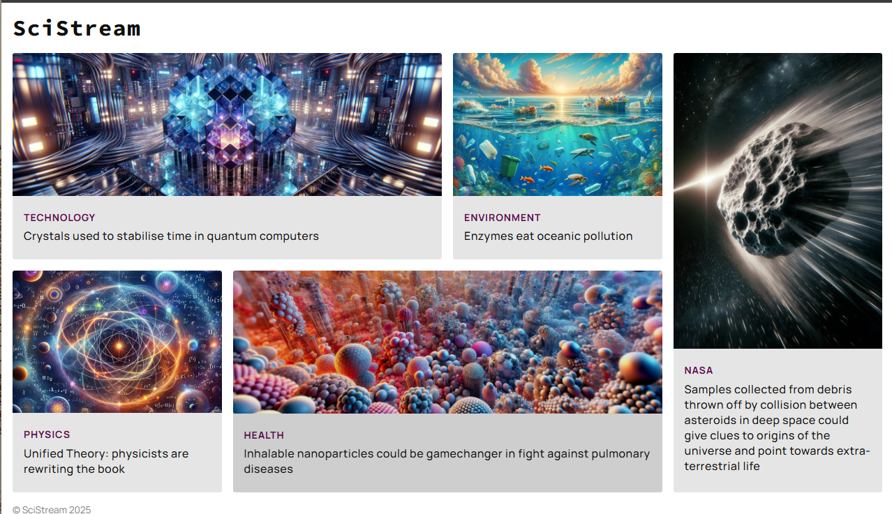

# SciStream

A modern, responsive science news aggregation website featuring articles across multiple scientific disciplines including technology, environment, NASA discoveries, physics, and health.

## Features

- **Responsive Design**: Optimized for mobile, tablet, and desktop viewing
- **Modern Typography**: Uses Manrope and Source Code Pro fonts for excellent readability
- **Grid-Based Layout**: CSS Grid implementation for flexible, responsive layouts
- **Accessibility**: Proper ARIA labels and semantic HTML structure
- **Category Organization**: Articles organized by scientific discipline
- **Clean UI**: Minimalist design with subtle hover effects and focus states

## 🌐 Live Demo
[Click here to view the live site (https://kvothe1387.github.io/SciStream/)](https://kvothe1387.github.io/SciStream/)

## Screenshots

### Desktop View

*Full desktop layout showing the complex grid system with all article categories*


## Technologies Used

- HTML5
- CSS3 (Grid Layout, Flexbox)
- Google Fonts (Manrope, Source Code Pro)
- Responsive Web Design principles

## Project Structure

```
scistream/
├── index.html          # Main homepage
├── index.css           # Stylesheet
├── images/             # Article images
│   ├── crystals.jpg
│   ├── plastics.jpg
│   ├── asteroid.jpg
│   ├── physics.jpg
│   └── nano.jpg
└── README.md
```

## Responsive Breakpoints

The website adapts to different screen sizes:

- **Mobile** (< 500px): Single column layout
- **Tablet** (500px - 869px): Two column grid
- **Desktop** (≥ 870px): Complex 12-column grid with optimized article placement

## Article Categories

1. **Technology** - Quantum computing and tech innovations
2. **Environment** - Environmental science and sustainability
3. **NASA** - Space exploration and astronomy
4. **Physics** - Theoretical and applied physics research
5. **Health** - Medical breakthroughs and health science

## Installation

1. Clone the repository:
```bash
git clone https://github.com/yourusername/scistream.git
```

2. Navigate to the project directory:
```bash
cd scistream
```

3. Open `index.html` in your browser or serve with a local server:
```bash
# Using Python
python -m http.server 8000

# Using Node.js http-server
npx http-server

# Using VS Code Live Server extension
# Right-click index.html and select "Open with Live Server"
```

## Usage

Simply open the website in your browser and click on any article card to navigate to the full article. The responsive design will automatically adjust to your screen size.


## Contributing

1. Fork the repository
2. Create a feature branch (`git checkout -b feature/new-feature`)
3. Commit your changes (`git commit -am 'Add new feature'`)
4. Push to the branch (`git push origin feature/new-feature`)
5. Create a Pull Request

## License

This project is licensed under the MIT License - see the [LICENSE](LICENSE) file for details.

## Future Enhancements

- [ ] Add article search functionality
- [ ] Implement dark mode toggle
- [ ] Add article filtering by category
- [ ] Include RSS feed integration
- [ ] Add social media sharing buttons
- [ ] Implement progressive web app features

## 👨‍💻 Author

- GitHub: [David McCullough](https://github.com/kvothe1387)
- LinkedIn: [David McCullough](https://www.linkedin.com/in/davidmcc-webdev/)
- Portfolio: [My Portfolio](https://davidmcc.netlify.app/)

---

*SciStream - Bringing the latest in science to your screen* 🧬